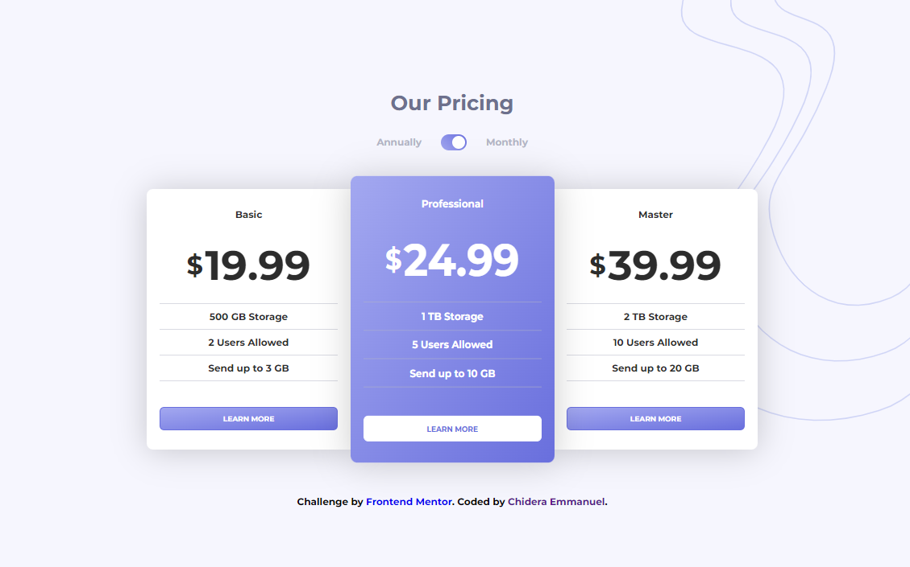

# Frontend Mentor - Pricing component with toggle solution

This is a solution to the [Pricing component with toggle challenge on Frontend Mentor](https://www.frontendmentor.io/challenges/pricing-component-with-toggle-8vPwRMIC). Frontend Mentor challenges help you improve your coding skills by building realistic projects.

## Table of contents

- [Overview](#overview)
  - [The challenge](#the-challenge)
  - [Screenshot](#screenshot)
  - [Links](#links)
- [My process](#my-process)
  - [Built with](#built-with)
  - [What I learned](#what-i-learned)
- [Author](#author)

**Note: Delete this note and update the table of contents based on what sections you keep.**

## Overview

### The challenge

Users should be able to:

- View the optimal layout for the component depending on their device's screen size
- Control the toggle with both their mouse/trackpad and their keyboard
- **Bonus**: Complete the challenge with just HTML and CSS

### Screenshot



### Links

- Solution URL: [Github Repo](https://github.com/chideraemmanuel/pricing-component-project)
- Live Site URL: [Live Demo](https://splendorous-quokka-6f44e3.netlify.app/)

## My process

### Built with

- Flexbox
- CSS Grid
- Responsive workflow

### What I learned

Took a while but i was finally able to make a toggle button and without any third party icon library :)
I've actually never made one before so it was a bit of a hassle.
Here's how I did it.
Feel free to share how you'd do yours! :)

```css
.toggle-icon {
  display: inline-block;
  /* background-color: hsl(237, 63%, 64%); */
  background: linear-gradient(45deg, hsl(236, 72%, 79%), hsl(237, 63%, 64%));
  width: 40px;
  height: 25px;
  border-radius: 50px;
  position: relative;
  cursor: pointer;
  transition: opacity 0.2s ease;
}

.toggle-icon:hover {
  opacity: 0.7;
}

.toggle-icon::before {
  content: "";
  position: absolute;
  left: 18px;
  top: 3px;
  bottom: 3px;
  width: 50%;
  height: 80%;
  border-radius: 50%;
  background-color: #fff;
}

.toggle-icon.active::before {
  left: 3px;
}
```

I also had to learn how to use Git and Github so as to ba able to push this to a repo. :)
Learnt netlify too. It was really fun!

## Author

- Frontend Mentor - [@chideraemmanuel](https://www.frontendmentor.io/profile/chideraemmanuel)
